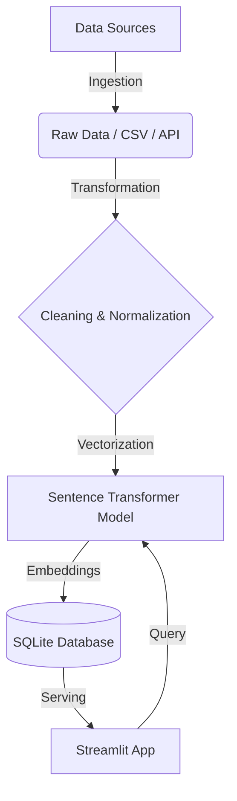

# 📚 Content-Based Book Recommendation Engine


**Book Finder** is a production-grade semantic search and recommendation engine designed to categorize and retrieve books based on contextual meaning rather than just keyword matching. It leverages advanced NLP techniques (`all-MiniLM-L6-v2`) to generate 384-dimensional vector embeddings for a deep understanding of book descriptions, titles, and genres.

The system features a robust **ETL pipeline** that handles data ingestion from OpenLibrary, automated cleaning, normalization, and efficient SQLite storage, served via a modern, glassmorphic Streamlit interface.

---

## ✨ Key Features

*   **🧠 Hybrid Semantic Search**: Combines **dense vector retrieval** (for conceptual matching) with **hard genre filtering** (for precision). Search for abstract concepts like *"a psychological thriller about memory loss"* and get accurate results.
*   **🔍 Advanced Filtering**: Intelligent pre-filtering logic that detects genre keywords in user queries (e.g., "mystery", "sci-fi") to narrow down search space instantly.
*   **💎 Premium UI/UX**: A polished Streamlit interface featuring:
    *   Glassmorphism aesthetics.
    *   Responsive "Perfect Grid" layouts.
    *   Dynamic stats dashboards.
    *   Interactive "How It Works" and "Data Insights" modules.
*   **🛡️ Robust Data Pipeline**:
    *   **Automated Ingestion**: Fetches data from OpenLibrary API with rate limiting and error handling.
    *   **Normalization**: Standardizes text fields for consistent deduplication.
    *   **Embedding Generation**: Uses normalized embeddings for cosine similarity optimization.

---

## 🏗️ System Architecture

The project follows a modular, microservices-inspired architecture for maintainability and scalability/



### Directory Structure
```
Semantic-Book-Recommendation-System/
├── components/         # Reusable UI components (Header, Footer)
├── views/              # Page logic (Home, About, Insights)
├── ingestion/          # Data harvesting scripts
├── transformation/     # Cleaning & Embedding generation
├── storage/            # Database schema & access layer
├── assets/             # CSS & Static files
├── run_pipeline.py     # CLI Entry point for data pipeline
└── app.py              # Main Application Entry point
```

---

## 📊 Data Statistics

The system currently manages a curated dataset of over **65,000** books.

| Metric | Value | Details |
| :--- | :--- | :--- |
| **Total Books** | **65,749** | Unique records after deduplication |
| **Total Authors** | **38,248** | Distinct authors in the catalog |
| **Total Genres** | **29,857** | Unique genre tags and categories |
| **Embedding Dims** | **384** | Vector size per book |
| **Model** | `all-MiniLM-L6-v2` | HuggingFace Sentence Transformer |

---

## 🚀 Getting Started

### Prerequisites
- Python 3.10 or higher
- `pip` (Python Package Manager)

### Installation

1.  **Clone the Repository**
    ```bash
    git clone https://github.com/your-repo/Semantic-Book-Recommendation-System.git
    cd Semantic-Book-Recommendation-System
    ```

2.  **Create a Virtual Environment (Recommended)**
    ```bash
    python3 -m venv venv
    source venv/bin/activate  # On Windows: venv\Scripts\activate
    ```

3.  **Install Dependencies**
    ```bash
    pip install -r requirements.txt
    ```

---

## 🛠️ Usage Guide

### 1. Data Pipeline
The `run_pipeline.py` script manages the entire lifecycle of the data. You can run all stages (Ingest → Transform → Store → Embed) with a single command.

**Run Full Pipeline:**
```bash
python3 run_pipeline.py --all --limit 50
```
*`--limit`: Number of books to fetch per subject from OpenLibrary.*

**Run Specific Stages:**
```bash
# Only ingest new data
python3 run_pipeline.py --ingest --limit 20

# Regenerate embeddings (required if model changes)
python3 run_pipeline.py --embed
```

### 2. Launch the Application
Start the Streamlit web server to interact with the Book Finder.

```bash
streamlit run app.py
```
The application will open automatically in your browser at `http://localhost:8501`.

---

## 👥 Contributors

**Team Node Nexus**
*   **Chauhan Aman Satpal** – *Data Engineer & AI Specialist*
*   **Devam Gandhi** – *Data Engineer & AI Specialist*

---
*Built with ❤️ for the Big Data Engineering Course.*
